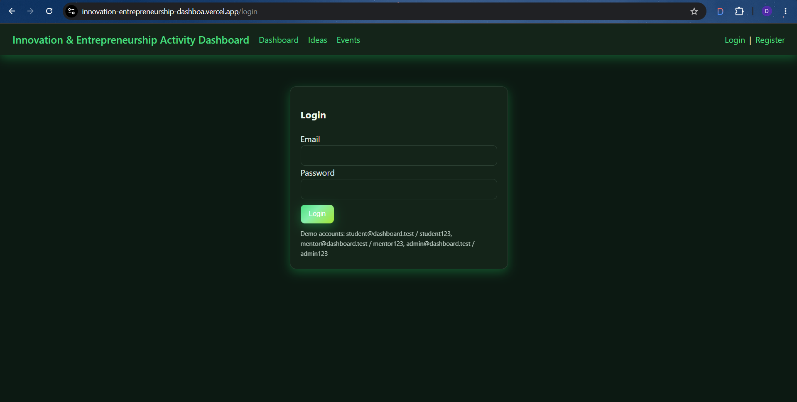
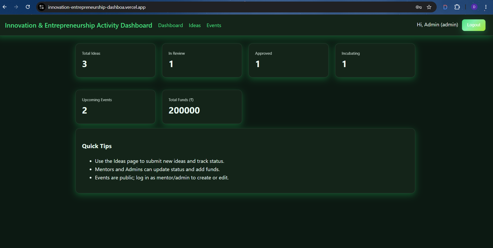
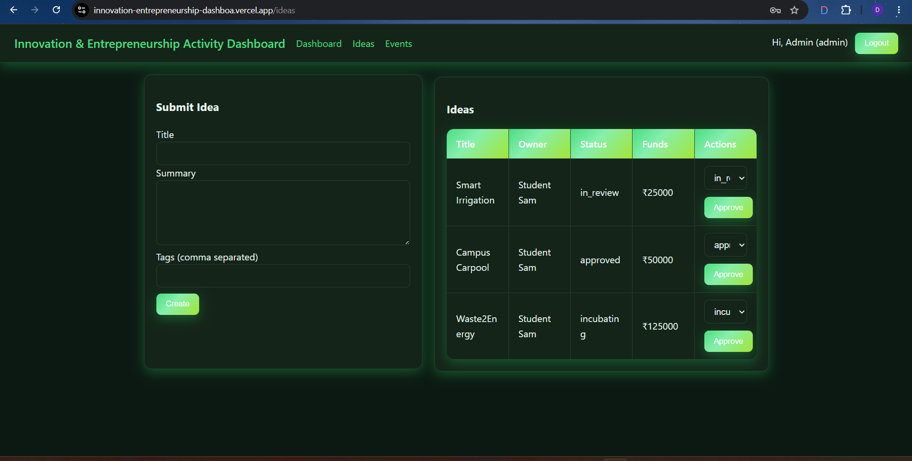
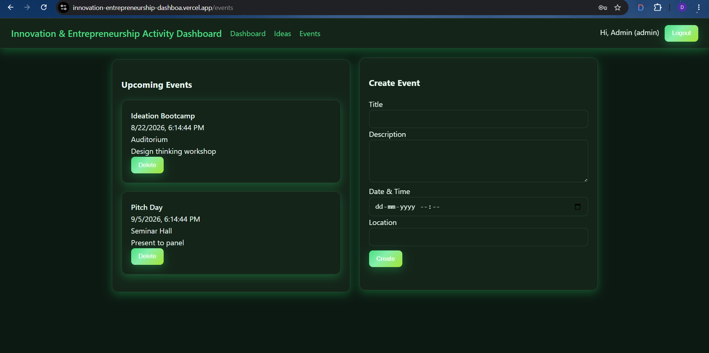

# 🚀 Innovation & Entrepreneurship Activity Dashboard

<p align="center">
  
  
  
  
  
  
</p>

<p align="center">
  <b>🚀 A full-stack dashboard for managing Innovation & Entrepreneurship activities.</b>
</p>

<p align="center">
  🌐 <a href="https://innovation-entrepreneurship-git-554848-devaraja-kattis-projects.vercel.app">
    <b>Live Demo</b>
  </a>
  &nbsp; • &nbsp;
  📂 <a href="https://github.com/DevKatti7560/innovation-entrepreneurship-dashboard">
    <b>GitHub Repository</b>
  </a>
</p>

<p align="center">
  ⭐ <b>Star the repository if you find this project useful!</b>
</p>

---

## 📌 About The Project

The **Innovation & Entrepreneurship Activity Dashboard** is a full-stack web application designed to manage and monitor college-level innovation and entrepreneurship activities.

The platform provides a centralized system for students, mentors, and administrators to manage:

* 💡 Innovation Ideas
* 📅 Events
* 💰 Funding Information
* 📊 Activity Metrics
* 👥 Role-Based Activities

The application uses **JWT authentication** and **role-based access control** to provide a secure and organized platform.

---

## ✨ Features

### 🔐 Authentication

* 👤 User registration and login
* 🔑 JWT-based authentication
* 🔒 Password hashing with bcrypt
* 🛡️ Protected routes
* 👥 Role-based authorization

### 💡 Idea Management

* 📝 Submit innovation ideas
* 👀 View submitted ideas
* 📈 Track idea status
* 🧑‍🏫 Mentor/Admin evaluation
* 💰 Funding information
* 🔄 CRUD operations

### 📅 Event Management

* 📆 View upcoming events
* ➕ Create and manage events
* 🎟️ Event registration
* ℹ️ Event information management

### 📊 Dashboard

* 📅 Upcoming events
* 💰 Total funding
* 📈 Innovation activity metrics
* 💡 Idea statistics
* 🗂️ Centralized dashboard

### 👥 User Roles

| 🎭 Role          | 🔑 Access                                       |
| ---------------- | ----------------------------------------------- |
| 🎓 **Student**   | Submit ideas, view events, and track activities |
| 🧑‍🏫 **Mentor** | Review ideas and manage activities              |
| 👨‍💼 **Admin**  | Manage ideas, events, and platform activities   |

---

# 📸 Screenshots

## 🔐 Login

<p align="center">
  
</p>

---

## 📊 Dashboard

<p align="center">
  
</p>

---

## 💡 Ideas Management

<p align="center">
  
</p>

---

## 📅 Events Management

<p align="center">
  
</p>

---

# 🛠️ Tech Stack

## 🎨 Frontend

| Technology      | Purpose             |
| --------------- | ------------------- |
| ⚛️ React 18     | UI Development      |
| ⚡ Vite          | Frontend Build Tool |
| 🧭 React Router | Client-side Routing |
| 🔗 Axios        | API Communication   |
| 🎨 CSS          | Styling             |

## ⚙️ Backend

| Technology    | Purpose               |
| ------------- | --------------------- |
| 🟢 Node.js    | Runtime Environment   |
| 🚂 Express.js | Backend Framework     |
| 🔐 JWT        | Authentication        |
| 🔒 bcrypt     | Password Hashing      |
| 🍃 Mongoose   | MongoDB ODM           |
| 🌐 CORS       | Cross-Origin Requests |

## 🗄️ Database

* 🍃 MongoDB
* ☁️ MongoDB Atlas

## ☁️ Deployment

* ▲ Vercel — Frontend
* 🚀 Render — Backend
* 🍃 MongoDB Atlas — Database

---

# 📂 Project Structure

```text
innovation-entrepreneurship-dashboard/
│
├── backend/
│   ├── src/
│   │   ├── config/
│   │   ├── controllers/
│   │   ├── middleware/
│   │   ├── models/
│   │   └── routes/
│   │
│   ├── app.js
│   ├── server.js
│   ├── seed.js
│   ├── package.json
│   └── .env.example
│
├── frontend/
│   ├── src/
│   │   ├── auth/
│   │   ├── lib/
│   │   ├── pages/
│   │   ├── App.jsx
│   │   ├── main.jsx
│   │   └── styles.css
│   │
│   ├── index.html
│   ├── package.json
│   └── vite.config.js
│
├── screenshots/
│   ├── dashboard.png
│   ├── events.png
│   ├── ideas.png
│   └── login.png
│
├── .gitignore
└── README.md
```

---

# ⚙️ Installation & Setup

## 1️⃣ Clone the Repository

```bash
git clone https://github.com/DevKatti7560/innovation-entrepreneurship-dashboard.git
cd innovation-entrepreneurship-dashboard
```

---

## 2️⃣ Backend Setup

Navigate to the backend directory:

```bash
cd backend
```

Install the required dependencies:

```bash
npm install
```

### 🔑 Create Environment Variables

Create a `.env` file inside the `backend` directory:

```env
MONGO_URI=your_mongodb_connection_string
JWT_SECRET=your_jwt_secret
PORT=5000
```

> ⚠️ Never commit your `.env` file to GitHub.

### 🌱 Seed the Database

```bash
npm run seed
```

### ▶️ Start the Backend

```bash
npm run dev
```

Backend will run at:

```text
http://localhost:5000
```

---

# 3️⃣ Frontend Setup

Open a **new terminal**.

Navigate to the frontend directory:

```bash
cd frontend
```

Install dependencies:

```bash
npm install
```

Start the development server:

```bash
npm run dev
```

Frontend will run at:

```text
http://localhost:5173
```

---

# 🔑 Demo Credentials

The application includes demo accounts for testing different roles.

### 🎓 Student

```text
Email: student@dashboard.test
Password: student123
```

### 🧑‍🏫 Mentor

```text
Email: mentor@dashboard.test
Password: mentor123
```

### 👨‍💼 Admin

```text
Email: admin@dashboard.test
Password: admin123
```

> 🔒 These credentials are provided for demonstration purposes only.

---

# 🔒 Security

The application implements several security mechanisms:

* 🔐 JWT-based authentication
* 🔒 Password hashing using bcrypt
* 🛡️ Protected API routes
* 👥 Role-based authorization
* 🌐 CORS configuration
* 🔑 Environment-based secrets
* 🚫 `.env` excluded from version control

---

# ☁️ Deployment Architecture

The application follows a full-stack deployment architecture:

```text
                         🐙 GitHub
                            │
              ┌─────────────┴─────────────┐
              │                           │
              ▼                           ▼
        ▲ Vercel                     🚀 Render
        Frontend                      Backend
              │                           │
              │                           │
              └─────────────┬─────────────┘
                            │
                            ▼
                    🍃 MongoDB Atlas
                         Database
```

---

# 🌐 Live Application

## 🖥️ Frontend — Vercel

🔗 **Live Demo**

https://innovation-entrepreneurship-git-554848-devaraja-kattis-projects.vercel.app

## ⚙️ Backend — Render

🔗 **Backend API**

https://innovation-entrepreneurship-dashboard.onrender.com

## 🗄️ Database — MongoDB Atlas

MongoDB Atlas is used as the production database for storing:

* 👤 User information
* 💡 Innovation ideas
* 📅 Events
* 💰 Funding information
* 📊 Activity data

---

# 🔄 Application Workflow

```text
👤 User
   │
   ▼
🔐 Login / Registration
   │
   ▼
🛡️ JWT Authentication
   │
   ▼
📊 Dashboard
   │
   ├──────────────► 💡 Ideas
   │                    │
   │                    ▼
   │              🧑‍🏫 Mentor Review
   │                    │
   │                    ▼
   │              👨‍💼 Admin Management
   │
   ├──────────────► 📅 Events
   │                    │
   │                    ▼
   │              🎟️ Registration
   │
   └──────────────► 📈 Activity Metrics
                         │
                         ▼
                    🍃 MongoDB
```

---

# 📈 Key Highlights

* 🚀 Full-stack MERN-style architecture
* 🔐 Secure JWT authentication
* 👥 Role-based access control
* 💡 Innovation idea management
* 📅 Event management
* 💰 Funding tracking
* 📊 Activity analytics
* 🔄 CRUD functionality
* ☁️ Cloud deployment
* 📱 Responsive user interface
* 🗄️ MongoDB Atlas integration

---

# 👨‍💻 Author

## 👋 Devaraja Katti

🎓 **B.E. Artificial Intelligence & Machine Learning**

💻 **Full-Stack Developer** • 🤖 **AI & ML Enthusiast**

### 🌐 Connect With Me

<p align="left">
  <a href="https://www.linkedin.com/in/devaraja-katti-58136a2a1/" target="_blank">
    
  </a>
  <a href="https://github.com/DevKatti7560" target="_blank">
    
  </a>
  <a href="https://innovation-entrepreneurship-git-554848-devaraja-kattis-projects.vercel.app" target="_blank">
    
  </a>
</p>

---

# ⭐ Support

If you found this project useful or interesting:

⭐ **Give the repository a star**

🍴 **Fork the project**

📢 **Share it with others**

---

<p align="center">

<b>🚀 Built with React • Node.js • Express • MongoDB</b>

<br><br>

<b>💡 Innovate • Build • Manage • Grow</b>

</p>